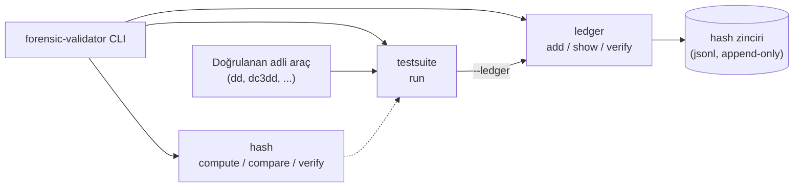

# forensic-validator


Adli bilişim araç ve yöntemlerini doğrulamak için basit bir CLI aracı (öğrenme projesi).

Üç modül içerir:

1. **hash** — dosya/imaj bütünlüğü doğrulama (MD5/SHA-1/SHA-256/SHA-512)
2. **testsuite** — NIST CFTT mantığına benzer şekilde, bir aracı bilinen girdilerle
   çalıştırıp çıktısını (exit code, stdout/stderr, üretilen dosyanın hash'i)
   beklenen sonuçla karşılaştıran test çerçevesi
3. **ledger** — zincir-i emanet (chain-of-custody) defteri; her kayıt bir öncekinin
   hash'ini içerir, böylece sonradan yapılan değişiklikler `verify` ile tespit edilir

## Mimari



`testsuite`, doğrulanan aracı (dd, dc3dd vb.) YAML'da tanımlı senaryolarla
çalıştırır; `hash` modülünü kullanarak sonucu doğrular ve `--ledger` verilirse
sonucu kurcalamaya karşı korumalı deftere yazar.

## Kurulum

```bash
python3 -m venv .venv
.venv/bin/pip install -e .
```

## Kullanım

### Hash doğrulama

```bash
forensic-validator hash compute dosya.img --algo sha256
forensic-validator hash compare orijinal.img kopya.img
forensic-validator hash verify dosya.img <beklenen_hash>
```

### Araç test suite'i

Test senaryolarını bir YAML dosyasında tanımlayın (örnek: `examples/suite.yaml`):

```yaml
suite: "cp aracı bütünlük testi"
cases:
  - name: "cp komutu dosyayı bit-bit kopyalar"
    vars:
      input: "sample_input.bin"
      output: "sample_output.bin"
    command: "cp {input} {output}"
    expect:
      exit_code: 0
      files_match:
        a: "{input}"
        b: "{output}"
        algo: sha256
```

Çalıştırma:

```bash
forensic-validator testsuite run examples/suite.yaml --report rapor.md
```

Desteklenen `expect` alanları: `exit_code`, `stdout_contains`, `stderr_contains`,
`file_hash` (`path`, `algo`, `expected`), `files_match` (`a`, `b`, `algo`).

`--ledger` ile çalıştırırsan, sonuç (PASS/FAIL sayısı ve raporun sha256'sı)
otomatik olarak zincir-i emanet defterine de kaydedilir:

```bash
forensic-validator testsuite run examples/dd_suite.yaml --ledger case001.jsonl --actor "ahmet"
```

`examples/dd_suite.yaml`, standart `dd` aracı için NIST CFTT tarzı bir
doğrulama örneği içerir (imaj alma, bilinen hash ile karşılaştırma, hatalı
girdide beklenen başarısızlık) ve sistemde ek kurulum gerektirmeden çalışır:

```bash
forensic-validator testsuite run examples/dd_suite.yaml
```

`examples/dc3dd_suite.yaml` aynı senaryoların adli imaging'e özel `dc3dd`
aracıyla (hash hesaplama ve loglama dahili olarak desteklenir) çalışan
karşılığıdır; kurulduğunda kullanılabilir:

```bash
sudo apt install -y dc3dd
forensic-validator testsuite run examples/dc3dd_suite.yaml
```

### Zincir-i emanet defteri

```bash
forensic-validator ledger add --file case001.jsonl --actor "ahmet" --action "imaj alındı" --details "disk1 -> image1.dd"
forensic-validator ledger show --file case001.jsonl
forensic-validator ledger verify --file case001.jsonl
```

`verify`, defterdeki herhangi bir kaydın sonradan değiştirilip değiştirilmediğini
hash zincirini yeniden hesaplayarak kontrol eder.

## Örnek çıktı

```
$ forensic-validator testsuite run examples/dc3dd_suite.yaml

# Test Raporu: examples/dc3dd_suite.yaml

**Sonuç: 6/6 test başarılı**

## [PASS] dc3dd bit-bit imaj alırken kaynak dosyayla aynı hash'i üretir
- exit_code: 0

## [PASS] dc3dd üretilen hash log'unda sha256 değeri yer alır
- exit_code: 0

## [PASS] dc3dd hatalı girdi dosyasında hata verir
- exit_code: 1

## [PASS] dc3dd cnt parametresiyle sadece istenen kadar veriyi kopyalar
- exit_code: 0

## [PASS] dc3dd iskip parametresiyle doğru offsetten veriyi okur
- exit_code: 0

## [PASS] farklı tampon boyutu (bufsz=512) yine de bit-bit doğru kopya üretir
- exit_code: 0
```

## Sınırlamalar

Bu bir öğrenme projesidir; gerçek adli vaka süreçlerinde kullanılacak
yazılımlar için NIST CFTT test metodolojisi, ilgili mevzuat ve kurumunuzun
akreditasyon gereksinimleri (ör. ISO/IEC 17025) esas alınmalıdır.

## Lisans

MIT — bkz. [LICENSE](LICENSE).
